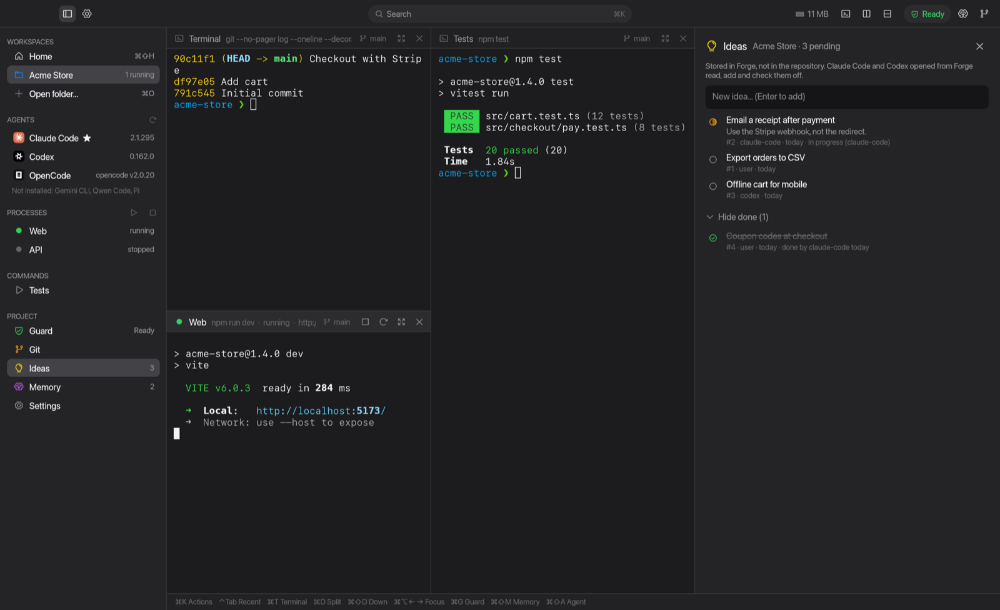

<div align="center">


# Forge

**Un espacio de trabajo nativo para macOS para programar con agentes de IA.**<br>
Terminales, procesos, agentes, memoria del proyecto y un Guard que revisa cada cambio antes de que salga de tu máquina: una ventana por proyecto.

[](https://github.com/DiegoAndres717/forge/actions/workflows/ci.yml)
[](https://github.com/DiegoAndres717/forge/releases/latest)


[](LICENSE)

[Descargar](#instalar) · [Funciones](#funciones) · [Mod de Claude Code](#mod-de-claude-code) · [Atajos](#atajos-de-teclado) · [Preguntas](#preguntas-frecuentes) · [English](README.md)


</div>

---

## Por qué Forge

Cuando trabajas con Claude Code, Codex u OpenCode, el día se reparte entre pestañas de terminal, servidores de desarrollo, notas y "¿pasaron los tests antes del push?". Forge reúne cada proyecto en un solo lugar:

- **Abres una carpeta y recuperas todo**: terminales, divisiones, servidores y agentes tal como los dejaste.
- **Agentes con memoria**: decisiones, errores resueltos e ideas se comparten con todos los agentes vía MCP.
- **Nada sale roto**: Project Guard aplica tus reglas (tamaño, secretos, lint, tests, build) antes de cada commit, push y pull request.
- **Nativo y ligero**: escrito en Rust con interfaz dibujada en GPU; sin Electron ni navegador embebido.

## Funciones

<table>
<tr>
<td width="50%"></td>
<td width="50%">

### Workspaces
Terminales reales con divisiones, foco por teclado, búsqueda (`⌘F`) e historial que sobrevive a los reinicios. ⌘-clic abre enlaces. Procesos administrados (`dev`, `api`…) con reinicio, puertos detectados y health checks.

</td>
</tr>
<tr>
<td>

### Project Guard
Reglas deterministas antes de **commit / push / PR**: tamaño del cambio, archivos prohibidos, detección de secretos y tus propias comprobaciones (`npm test`, `cargo clippy`…), ejecutadas en una copia aislada. Las excepciones piden motivo y quedan registradas. Crea el commit o abre el pull request (con `gh`) desde el panel.

</td>
<td></td>
</tr>
<tr>
<td></td>
<td>

### Paleta de comandos
`⌘K` llega a todo: abrir o reanudar un agente, iniciar o detener procesos, cambiar de proyecto, pasar Guard, cambiar ajustes. Busca en inglés y en español.

</td>
</tr>
<tr>
<td>

### Ideas y memoria
Lista de pendientes por proyecto **guardada fuera del repo**. Claude Code y Codex la leen, añaden ideas y las tachan. La memoria del proyecto (decisiones, errores resueltos, convenciones) se comparte con los agentes por MCP.

</td>
<td></td>
</tr>
<tr>
<td></td>
<td>

### Comandos peligrosos
`rm -rf` fuera del proyecto, `git reset --hard`, `git push --force`, `git clean -f`, `docker system prune`, `DROP DATABASE`… piden confirmación en la ventana, también cuando los lanza un agente.

</td>
</tr>
<tr>
<td>

### Panel de Git
Cambio de rama, preparar / quitar / descartar, commit, pull, push e historial reciente sin salir del proyecto.

</td>
<td></td>
</tr>
</table>

Además: notificaciones nativas cuando un agente termina, un proceso falla o Guard bloquea (solo con Forge en segundo plano) · aviso de actualizaciones · interfaz en inglés y español.

## Instalar

> **Requisitos:** macOS 13 Ventura o superior, en Apple Silicon o Intel (app universal).

### Descarga (recomendado)

1. Descarga `Forge-x.y.z.dmg` de la [última versión](https://github.com/DiegoAndres717/forge/releases/latest).
2. Ábrelo y arrastra **Forge** a **Aplicaciones**.
3. La primera vez, **clic derecho en Forge → Abrir → Abrir**. Forge aún no está notarizado por Apple, así que con doble clic macOS dice que "no se puede abrir". Si aun así no abre, ejecuta:

   ```sh
   xattr -dr com.apple.quarantine /Applications/Forge.app
   ```

### Compilar desde el código

```sh
brew install rustup && rustup-init -y      # Rust estable
git clone https://github.com/DiegoAndres717/forge.git && cd forge
./scripts/install-app.sh                   # compila e instala ~/Applications/Forge.app
# FORGE_UNIVERSAL=1 ./scripts/install-app.sh   → binario universal (Apple Silicon + Intel)
```

### Línea de comandos (opcional)

```sh
ln -sf /Applications/Forge.app/Contents/MacOS/forge /opt/homebrew/bin/forge
forge help
```

El idioma se cambia en Ajustes (`⌘,`).

## Primeros pasos

1. Abre Forge y elige una carpeta (o arrástrala a la ventana, o ejecuta `forge .`).
2. Funciona sin configurar nada. Para guardar tu layout y tus procesos, usa **Ajustes → Crear .forge/project.toml** en la barra lateral: Forge lo rellena con los scripts que encuentre en `package.json`.
3. Pulsa **Claude Code**, **Codex** u **OpenCode** en la barra lateral para abrir un agente en el proyecto.
4. Pulsa `⌘G` antes de hacer commit para ver si el cambio está listo.

## Mod de Claude Code

Cualquier `claude` que se ejecute en una terminal de Forge (escrito a mano, `claude --resume`, `claude -c` o abierto desde la barra lateral) carga el mod de Forge automáticamente. No se instala nada en tu configuración de Claude ni se añade nada al repo; fuera de Forge, Claude funciona como siempre.

- **Subagentes más baratos**: `forge:explorer` (Haiku) busca y lee código, `forge:reviewer` (Sonnet) corre tests y revisa, `forge:architect` (Opus) resuelve lo difícil. El modelo principal delega y conserva su contexto y su caché.
- **Banda** encima del cuadro de texto: estado de Guard, ideas pendientes, tokens de la sesión (nuevos frente a caché) y barras de uso del plan (5 h y semanal).
- **Consumo por modelo**: cada turno, subagentes incluidos, queda registrado; se ve en Ajustes.
- **Comandos sin tokens**: `/ideas`, `/guard`, `/remember`.

## Atajos de teclado

| Atajo | Acción | Atajo | Acción |
|---|---|---|---|
| `⌘K` | Paleta de comandos | `⌘G` | Project Guard |
| `⌘O` | Abrir carpeta | `⌘⇧M` | Memoria |
| `⌘1`…`⌘9` | Cambiar de proyecto | `⌘⇧A` | Abrir agente |
| `⌃Tab` | Proyecto reciente | `⌘F` | Buscar en la terminal |
| `⌘T` | Nueva terminal | `⌘B` | Mostrar/ocultar barra lateral |
| `⌘D` / `⌘⇧D` | Dividir a la derecha / abajo | `⌘⇧H` | Inicio |
| `⌘⌥←` `⌘⌥→` | Mover el foco | `⌘,` | Ajustes |

## Configuración

Por proyecto, en `.forge/` (súbelo al repo para compartirlo con tu equipo):

| Archivo | Qué contiene |
|---|---|
| `project.toml` | Layout (terminales y divisiones), procesos y comandos |
| `rules.toml` | Reglas y comprobaciones de Guard por etapa |
| `agents.toml` | Agentes y cómo se lanzan |
| `routing.toml` | Enrutado de modelos para revisiones con IA (`forge ai init`) |

La configuración global está en `~/.config/forge/config.toml` (fuentes y más). Ideas, memoria e historial se guardan en la base de datos de Forge, nunca en el repo.

La referencia completa de la CLI está en el [README en inglés](README.md#configuration) y en `forge help`.

## Preguntas frecuentes

**¿Forge envía mi código a algún sitio?**
No. Forge funciona en local; su única llamada de red es la comprobación de actualizaciones en GitHub Releases (más la revisión con IA opcional, si la activas en `routing.toml`). Los agentes que lances hablan con sus proveedores como siempre.

**¿Macs Intel? ¿Windows?**
Macs Intel: sí, la app es universal. Windows y Linux: por ahora no.

**¿Necesito Claude Code?**
No. Terminales, procesos, Guard, Git e ideas funcionan sin agentes. Forge detecta Claude Code, Codex, OpenCode, Gemini CLI, Qwen Code y Pi si están instalados.

**¿Cómo reporto un error?**
Abre un [issue](https://github.com/DiegoAndres717/forge/issues) con lo que hiciste, lo que esperabas y, si puedes, una captura.

## Licencia

[MIT](LICENSE) © Diego Andres Salas
