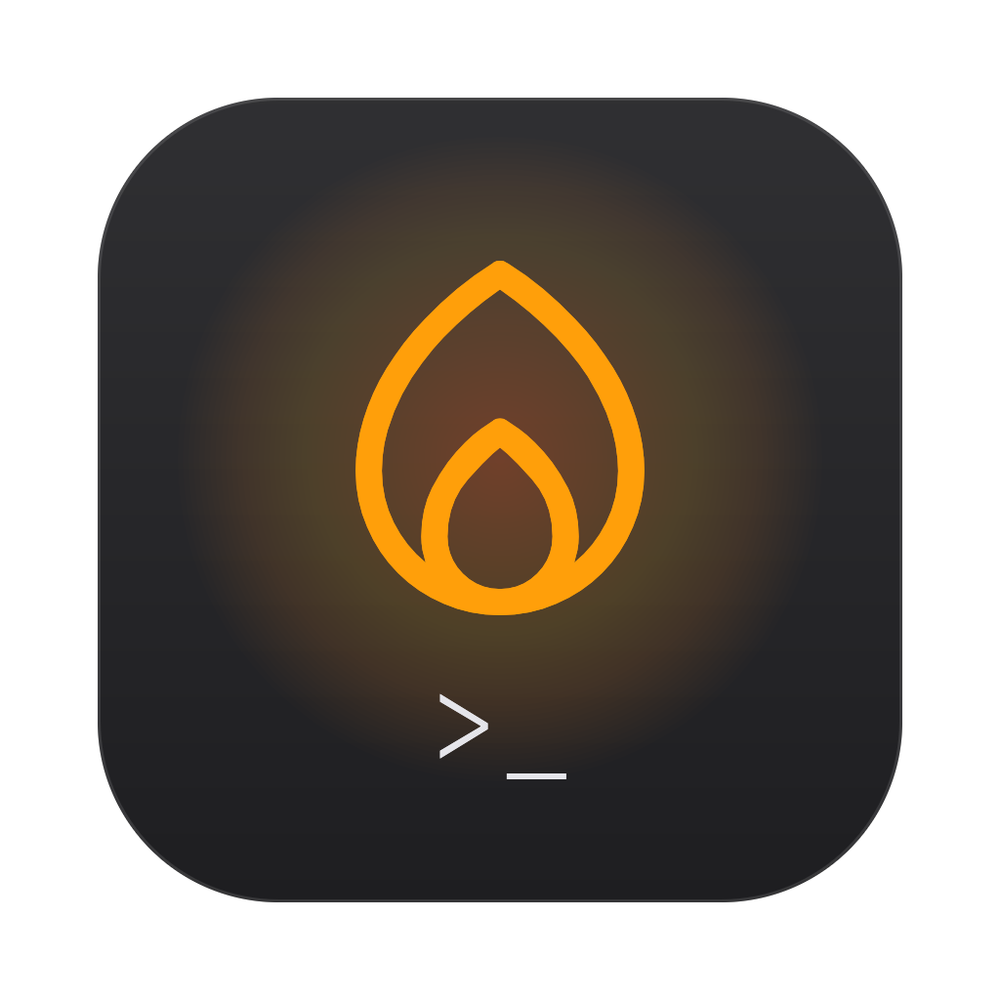
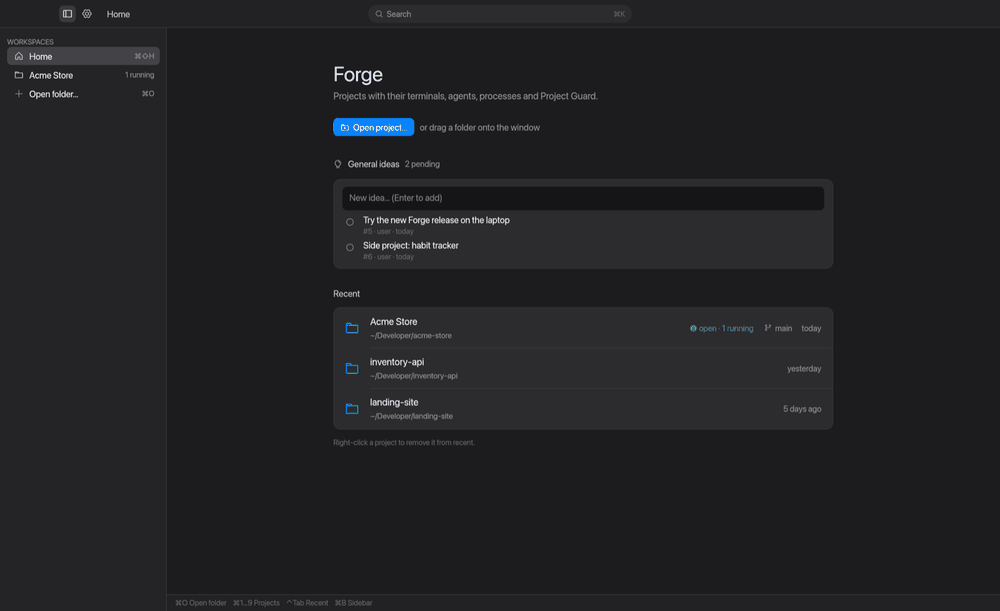
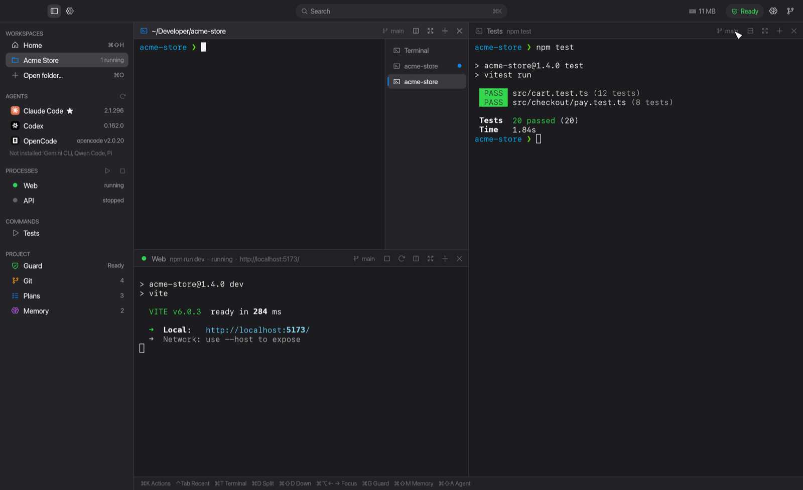
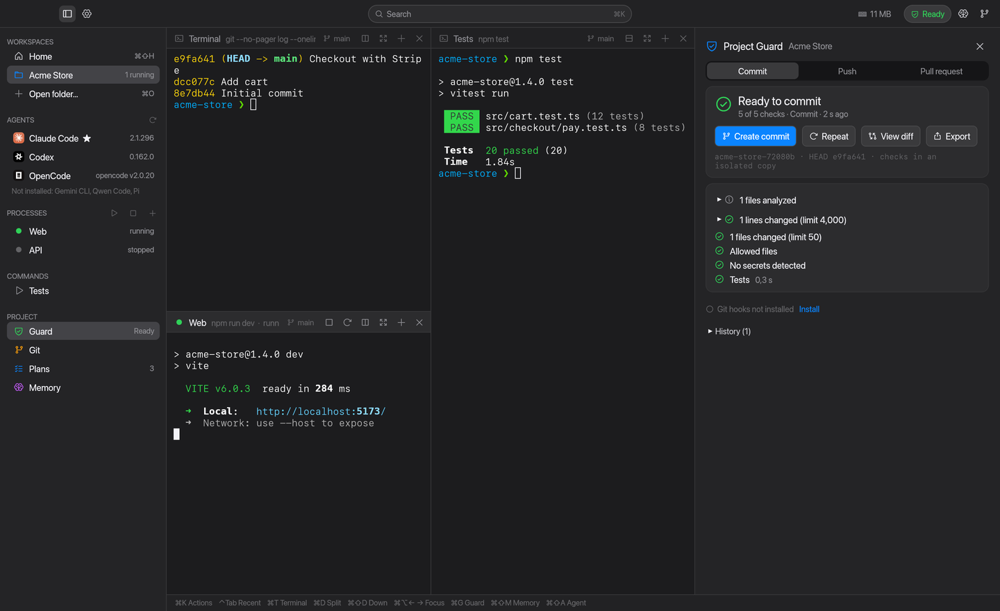
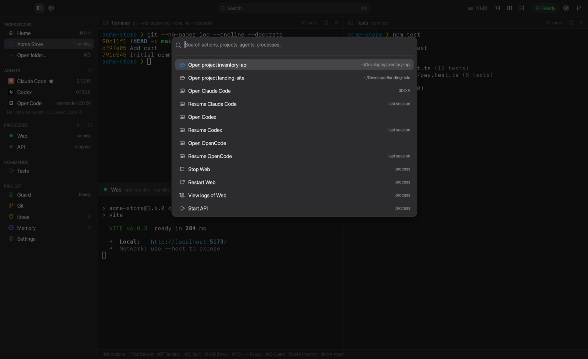
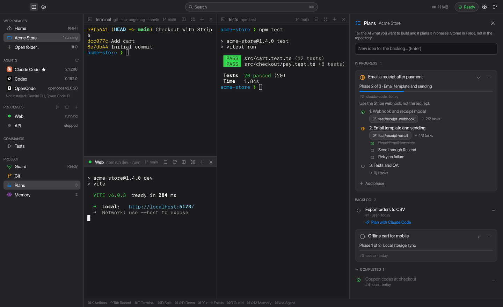
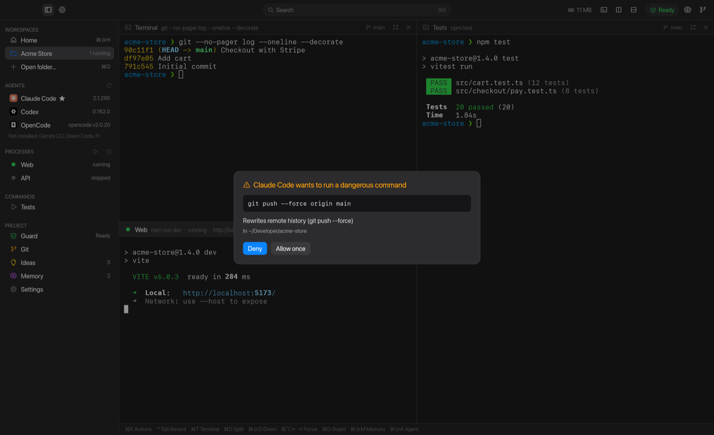
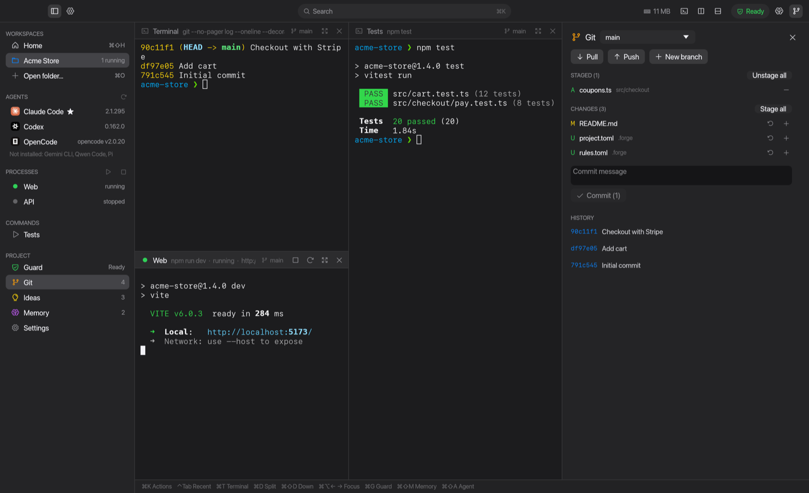

<div align="center">



# Forge

**A native macOS workspace for building software with AI agents.**<br>
Terminals, processes, agents, project memory and a Guard that checks every change before it leaves your machine — one window per project.

[](https://github.com/DiegoAndres717/forge/actions/workflows/ci.yml)
[](https://github.com/DiegoAndres717/forge/releases/latest)


[](LICENSE)

[Download](#install) · [Features](#features) · [Claude Code mod](#claude-code-mod) · [Shortcuts](#keyboard-shortcuts) · [FAQ](#faq) · [Español](README.es.md)



</div>

---

## Why Forge

When you work with Claude Code, Codex or OpenCode, your day is scattered across terminal tabs, dev servers, notes and "did the tests pass before I pushed?". Forge puts each project in one place:

- **Open a folder, get your setup back** — terminals, splits, running dev servers and agents, exactly as you left them.
- **Agents that plan and remember** — phased plans, the backlog and project memory are shared with every agent through MCP.
- **Nothing ships broken** — Project Guard runs your rules (size, secrets, lint, tests, build) before each commit, push and pull request.
- **Native and light** — written in Rust with a GPU-rendered UI; no Electron, no embedded browser.

## Features

<table>
<tr>
<td width="50%"></td>
<td width="50%">

### Workspaces
Real terminals, **VS Code–style**: stack several in one panel (**+** or `⌘T`), switch from the side list (`⌘⇧]` / `⌘⇧[`), drag to reorder, and see which hidden ones printed something. Splits you can rotate, keyboard focus, scrollback search (`⌘F`), folder suggestions as you type and history that survives restarts. ⌘-click opens links, even wrapped ones. Managed processes (`dev`, `api`…) with restart, detected ports and health checks. Every action also lives in the **macOS menu bar** with its shortcut.

</td>
</tr>
<tr>
<td>

### Project Guard
Deterministic rules before **commit / push / PR**: change size, forbidden files, secret detection and your own checks (`npm test`, `cargo clippy`…), run in an isolated copy. Exceptions need a reason and are logged. Create the commit or open the pull request (via `gh`) straight from the panel.

</td>
<td></td>
</tr>
<tr>
<td></td>
<td>

### Command palette
`⌘K` reaches everything: open or resume an agent, start/stop processes, switch projects, run Guard, change settings. Search works in English and Spanish.

</td>
</tr>
<tr>
<td>

### Plans & memory
Tell the AI what you want to build and it saves a **plan in phases** — each phase with its status, an optional Git branch and tasks it ticks off as it works. Ideas for later go to the **backlog**; one click on *Plan with Claude Code* turns one into a plan. Three sections (In progress · Backlog · Completed), **stored outside the repo**, shared over MCP with Claude Code, Codex and OpenCode, together with the project memory (decisions, fixed errors, conventions).

</td>
<td></td>
</tr>
<tr>
<td></td>
<td>

### Dangerous command approval
`rm -rf` outside the project, `git reset --hard`, `git push --force`, `git clean -f`, `docker system prune`, `DROP DATABASE`… ask for confirmation in the window — even when an agent runs them.

</td>
</tr>
<tr>
<td>

### Git panel
Branch switcher, stage / unstage / discard, commit, pull, push and recent history — without leaving the project.

</td>
<td></td>
</tr>
</table>

Also: native notifications when an agent finishes, a process fails or Guard blocks (only while Forge is in the background) · update checks · English and Spanish UI.

## Install

> **Requirements:** macOS 13 Ventura or later, on Apple Silicon or Intel (universal app).

### Download (recommended)

1. Download `Forge-x.y.z.dmg` from the [latest release](https://github.com/DiegoAndres717/forge/releases/latest).
2. Open it and drag **Forge** to **Applications**.
3. The first time, **right-click Forge → Open → Open**. Forge isn't notarized by Apple yet, so a plain double-click shows "cannot be opened". If macOS still refuses, run:

   ```sh
   xattr -dr com.apple.quarantine /Applications/Forge.app
   ```

### Build from source

```sh
brew install rustup && rustup-init -y      # Rust stable
git clone https://github.com/DiegoAndres717/forge.git && cd forge
./scripts/install-app.sh                   # builds and installs ~/Applications/Forge.app
# FORGE_UNIVERSAL=1 ./scripts/install-app.sh   → universal binary (Apple Silicon + Intel)
```

### Command line (optional)

```sh
ln -sf /Applications/Forge.app/Contents/MacOS/forge /opt/homebrew/bin/forge
forge help
```

## Quick start

1. Open Forge and pick a folder (or drag one onto the window, or run `forge .`).
2. It works with no setup. To save your layout and processes, use **Settings → Create .forge/project.toml** in the sidebar: Forge fills it with the scripts it finds in `package.json`.
3. Click **Claude Code**, **Codex** or **OpenCode** in the sidebar to start an agent in the project.
4. Press `⌘G` before committing to see whether the change is ready.

## Claude Code mod

Any `claude` started inside a Forge terminal — typed by hand, `claude --resume`, `claude -c` or opened from the sidebar — loads Forge's mod automatically. Nothing is installed into your Claude config and nothing is added to your repo; outside Forge, Claude behaves as usual.

- **Cheaper subagents** — `forge:explorer` (Haiku) searches and reads code, `forge:reviewer` (Sonnet) runs tests and reviews, `forge:architect` (Opus) takes the hard problems. The main model delegates and keeps its context and cache.
- **Live status band** above the prompt — Guard status, plans in progress and backlog, the model working right now (● opus / ↳ explorer: … (haiku)), session tokens (new vs. cached) and your plan usage bars (5h and weekly).
- **Usage per model** — every turn, subagents included, is recorded; see it in Settings.
- **Zero-token commands** — `/forge-plans`, `/forge-guard`, `/forge-remember` (type `/forge` to list them).

## Keyboard shortcuts

| Shortcut | Action | Shortcut | Action |
|---|---|---|---|
| `⌘K` | Command palette | `⌘G` | Project Guard |
| `⌘O` | Open folder | `⌘⇧M` / `⌘⇧I` | Memory / Plans |
| `⌘1`…`⌘9` | Switch project | `⌘⇧A` | Open agent |
| `⌃Tab` | Recent project | `⌘F` | Search in terminal |
| `⌘T` | New terminal (same panel) | `⌘B` | Toggle sidebar |
| `⌘⇧]` `⌘⇧[` | Next / previous terminal | `⌘]` `⌘[` | Next / previous panel |
| `⌘D` / `⌘⇧D` | Split right / down | `⌘⇧H` | Home |
| `⌘⌥←` `⌘⌥→` | Move focus | `⌘,` | Settings |

## Configuration

Per project, in `.forge/` (commit it to share with your team):

| File | What it holds |
|---|---|
| `project.toml` | Layout (terminals and splits), processes, commands |
| `rules.toml` | Guard rules and checks per stage |
| `agents.toml` | Agents and how to launch them |
| `routing.toml` | Model routing for AI reviews (`forge ai init`) |

Global settings live in `~/.config/forge/config.toml` (fonts and more). Plans, memory and history are stored in Forge's own database, never in the repo.

<details>
<summary><b>CLI reference</b></summary>

```text
forge [folder]                        opens the app (and that project)
forge guard commit|push|pr            checks whether the project is ready
forge guard status                    project rules, hooks and exceptions
forge guard allow <rule> --reason "…" adds an exception with a reason
forge guard history | report          latest validations / Markdown report
forge hooks install|uninstall|status  pre-commit and pre-push hooks
forge agent list | open <id>          detected agents / open one here
forge doctor                          checks git, database, settings, hooks and agents
forge ai route | usage                change risk / model usage this month
forge memory search|add|list|delete   project memory
forge plans [show|add|start|done|phase|task]   plans and backlog (outside the repository)
forge mcp                             MCP server for agents
```

Run `forge help` for every option.

</details>

## FAQ

**Does Forge send my code anywhere?**
No. Forge runs locally; its only network call is the update check against GitHub Releases (plus the optional AI review, if you enable it in `routing.toml`). Agents you launch talk to their own providers as usual.

**Intel Macs? Windows?**
Intel Macs: yes, the app is universal. Windows and Linux: not for now.

**Do I need Claude Code?**
No. Terminals, processes, Guard, Git and plans work without any agent. Forge detects Claude Code, Codex, OpenCode, Gemini CLI, Qwen Code and Pi if they're installed.

**How do I report a bug?**
Open an [issue](https://github.com/DiegoAndres717/forge/issues) with what you did, what you expected and a screenshot if possible.

## Development

```sh
cargo test --workspace                                  # unit, integration and UI end-to-end
cargo clippy --workspace --all-targets -- -D warnings
FORGE_PREVIEW_DIR=/tmp/forge cargo test --release --bin forge ui_preview -- --ignored   # screenshots
```

```text
crates/forge-core/   Core logic: Guard, hooks, agents, model routing, memory, MCP, SQLite
src/                 The app: window (egui), terminals, layout, processes and CLI
claude-plugin/       The Claude Code mod (validate: claude plugin validate claude-plugin)
tests/               Integration against the real binary: Git hooks and MCP server
```

UI end-to-end tests drive the real app with `egui_kittest` (no GPU needed), finding controls by their accessible names.

## License

[MIT](LICENSE) © Diego Andres Salas
